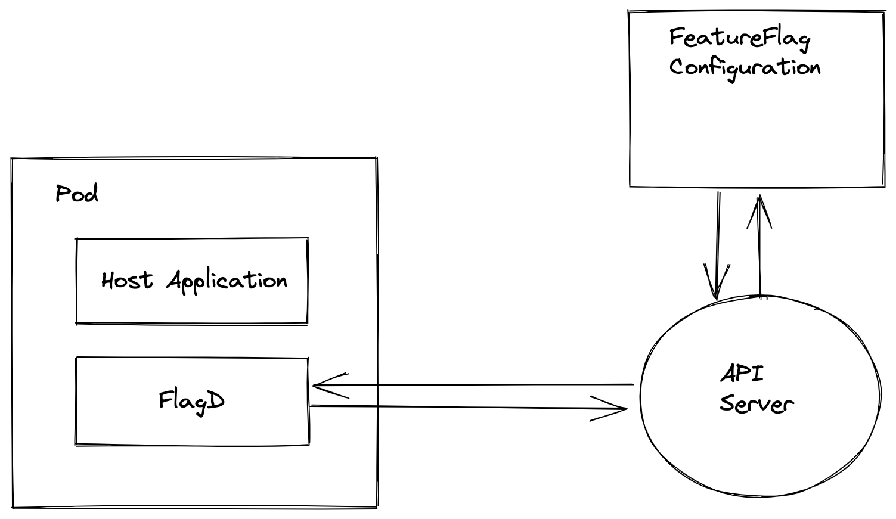

## 004-OFEP-inotfiy-interface

## State: WITHDRAWN

FlagD is often used in the context of Kubernetes.

It is typically deployed by OFO as a companion sidecar and uses a volume injected via configmap as the source of its flags to evaluate.

I propose there may be a more optimal way to enable faster refreshing on flag changes by subscribing to a notifier against the Kubernetes API. This is inspired by this discussion with @therealmitchconnors and also the regression in being able to trigger configmap volume reloads through updating annotations within a deployment.

This is not a silverbullet and I think for academic purposes alone it is worth exploring if we would want to move in this direction.
The only real benefit here is speed of flag updates.

## Design

FlagD would start with the typical arguments of flagd start --sync-service kubernetes-api or something similar.
This would use the token mounted from /var/run/secrets/kubernetes.io/serviceaccount to request to watch events for the FeatureFlagConfiguration. The FeatureFlagConfiguration could be determined by the pod getting its own annotations on start through the API and performing a look-up.

## Benefits

Near real-time updates to flags within FlagD and presented to the service layer
## Caveats
 
Additional stress on the API Server; it becomes a watcher per open-feature enabled pod; I am wary of this design pattern

This would intractably tightly couple FlagD to the Kubernetes golang bindings and limit multi-arch compatibility