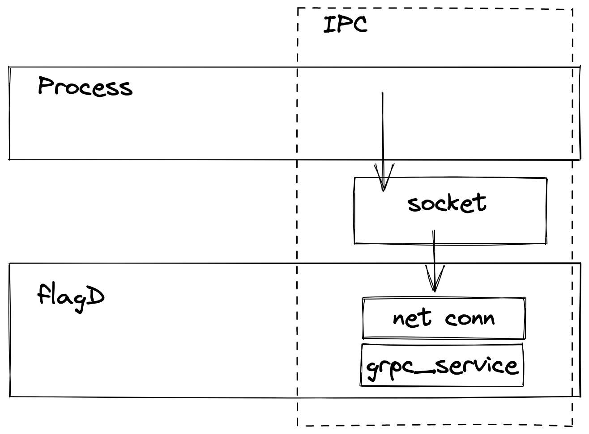

## NAME

## State: ( DRAFTING )

Often when flagD is required to talk to another application within the same pod, it is far faster to use a unix socket 
than the full TCP/IP stack. There are also permission benefits around using a socket in terms of file ownership.
This OFEP outlines an approach to use gRPC over Unix sockets to enable this.



## Background

It is possible within golang to use a unix socket as a `*net.Conn`
The following illustration exemplifies how it can be used to create the underlying gRPC transport.

```
conn, err := net.DialUnix("unix", nil, "unix://proc/flagD.sock")
	return conn, err

conn, err := grpc.Dial(server_file, grpc.WithInsecure(), grpc.WithDialer(UnixConnect))
	if err != nil {
		log.Fatal("did not connect: %v", err)
	}
	defer conn.Close()
```

This shows how the machinery is already present to enable IPC through this interface.

## Proposal

I propose that we introduce an additional layer of gRPC options in the `grpc_service.go` in flagD.
This would allow a new `serveSocket` method to be created and facilitate the IPC functionality.
_Note this wouldn't be a TLS enabled transport_

### Implementation

- [x] Create a socket path parameter within flagD
- [ ] `grpc_service.go` to support unix sockets through a new method that returns a net connection
- [ ] Modifiy the existing `http_service` code to leverage a similar net connection start
- [ ] Write tests