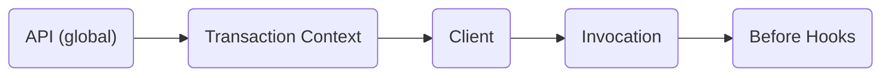

## NAME

## State: DRAFTING

Evaluation context may be used to conditionally control the value returned from a flag evaluation. You could, for example, enable a feature for all users with a specific email domain. Using evaluation context propagation, application developers can set evaluation context where it's convenient (i.e. an auth service) and have it persist for the length of a transaction (i.e. request or thread).

## Background

Many languages provide a mechanism for storing data for the length of a single transaction. This can be used to store evaluation context that can be transparently merged before flag evaluation. The implementation will vary by technology. For example, Java may use [thread local][thread-local], Golang may use [Go Context][go-context], and Node may use [async hooks][async-hooks].

## Proposal

I propose that we introduce a way to register a transaction context propagator to the global OpenFeature API. Once registered, evaluation context can be defined at any point in the transaction. When a flag is evaluated, the transaction context is merged based on a defined merging order

### Register Context Propagator

In some runtimes (i.e. node), there isn't a native solution for transaction context propagation that would work in all situations. For that reason, it would be beneficial to provide the ability to register a transaction propagator on the global OpenFeature API.

```typescript
/**
 * An example transaction context manager that utilizes async_hooks added in
 * node 12.17 and marked as stable in node 16.4
 */
class AsyncLocalStorageTransactionContext implements TransactionContextManager {
  private asyncLocalStorage = new AsyncLocalStorage<EvaluationContext>();

  getTransactionContext(): EvaluationContext {
    return this.asyncLocalStorage.getStore() ?? {};
  }

  setTransactionContext(
    context: EvaluationContext,
    callback: () => void
  ): void {
    this.asyncLocalStorage.run(context, callback);
  }
}

OpenFeature.setTransactionContextPropagator(
  new AsyncLocalStorageTransactionContext()
);
```

> NOTE: This may not be required for all languages/runtimes

### Set Transaction Context

Setting transaction context will vary based on the language. In JavaScript, it may look like this:

```typescript
/**
 * This example is based on an express middleware.
 */
use(req: Request, _res: Response, next: NextFunction) {
  OpenFeature.setTransactionContext({ targetingKey: req.user.id }, () => {
    next();
  });
}
```

> NOTE: Setting the same property multiple times will override the previous value.

### Get Transaction Context

Getting transaction context happens automatically in the OpenFeature client before flag evaluation occurs.

### Context Merge Order

Transaction context merging should happen between global context and client context. This provides a reasonable balance between context inheritance and the ability to override context properties.



### Implementation

- [ ] Example implementation in Node
- [ ] Example implementation in Golang

[thread-local]: https://docs.oracle.com/javase/8/docs/api/java/lang/ThreadLocal.html
[go-context]: https://pkg.go.dev/context
[async-hooks]: https://nodejs.org/api/async_hooks.html
