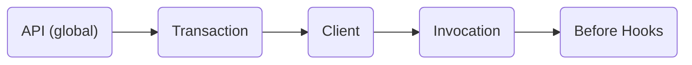

## Transaction Context Propagation

## State: DRAFTING

Evaluation context is a container for all contextual data that can be used used to conditionally control the value returned from a flag evaluation. Currently, developers are responsible for explicitly defining and supplying evaluation context during flag evaluation.

_Transaction context_, a subset of the evaluation context, is a container for transaction specific data (e.g. user id, user agent, IP) that lives for the duration of a transaction. With transaction context propagation, a developer can set transaction context where it's convenient (e.g. an auth service) and have it persist for the length of a transaction (e.g. a request or thread). OpenFeature will then merge transaction context with evaluation context before flag evaluation.

## Background

Many languages provide a mechanism for storing data for the length of a single transaction. This can be used to store transaction context that can be automatically merged with the evaluation context before flag evaluation. The implementation will vary by technology. For example, Java may use [ThreadLocal][thread-local], Golang may use [Go Context][go-context], and Node may use [async hooks][async-hooks].

## Proposal

This proposal introduces a way to register a transaction context propagator to the global OpenFeature API. Once registered, transaction context can be augmented or mutated at any point in the transaction. When a flag is evaluated, the transaction context is merged with evaluation context based on the merge order defined below.

### Register Transaction Context Propagator

In some runtimes (e.g. node), there isn't a native solution for transaction context propagation that would work in all situations. For that reason, it would be beneficial to provide the ability to register a transaction propagator on the global OpenFeature API.

```typescript
/**
 * An example transaction context manager that utilizes async_hooks added in
 * node 12.17 and marked as stable in node 16.4
 */
class AsyncLocalStorageTransactionContext implements TransactionContextManager {
  private asyncLocalStorage = new AsyncLocalStorage<EvaluationContext>();

  getTransactionContext(): EvaluationContext {
    return this.asyncLocalStorage.getStore() ?? {};
  }

  setTransactionContext(
    context: EvaluationContext,
    callback: () => void
  ): void {
    this.asyncLocalStorage.run(context, callback);
  }
}

OpenFeature.setTransactionContextPropagator(
  new AsyncLocalStorageTransactionContext()
);
```

### Set Transaction Context

Setting transaction context will vary based on the language. In JavaScript, it may look like this:

```typescript
/**
 * This example is based on an express middleware.
 */
use(req: Request, _res: Response, next: NextFunction) {
  OpenFeature.setTransactionContext({ targetingKey: req.user.id }, () => {
    next();
  });
}
```

> NOTE: Setting the same property multiple times will override the previous value.

### Get Transaction Context

Getting transaction context happens automatically in the OpenFeature client before flag evaluation occurs.

### Context Merge Order

Transaction context merging should happen between global context and client context. This provides a reasonable balance between context inheritance and the ability to override context properties.



### Implementation

- [ ] Example implementation in Node
- [ ] Example implementation in Golang

[thread-local]: https://docs.oracle.com/javase/8/docs/api/java/lang/ThreadLocal.html
[go-context]: https://pkg.go.dev/context
[async-hooks]: https://nodejs.org/api/async_hooks.html
