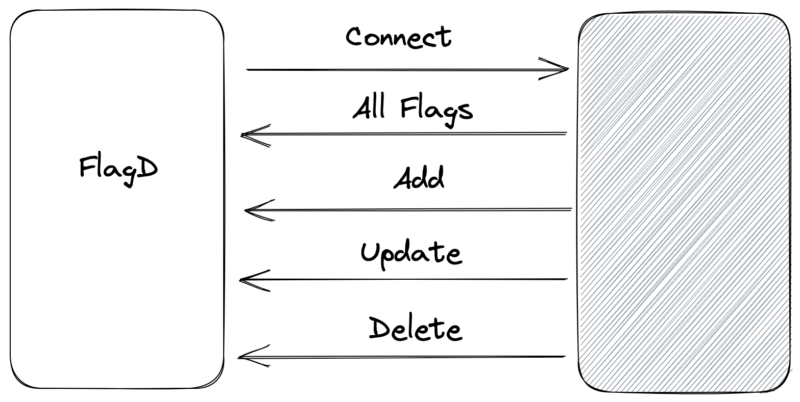

# Add gRPC sync support to flagd

## State: APPROVED

This OFEP proposes to introduce gRPC syncs to flagd. gRPC sync will act similar to existing remote HTTP URL syncs. But
going beyond periodic pulls, flagd can utilize gRPC server streaming to receive near real-time updates, pushed from a
flag management system.

## Background

gRPC server streaming allows clients to listen and react to server-pushed data. For flagd, this perfectly matches the
ISync interface and current sync mechanism implementations.

The gRPC schema will be defined by flagd and supporting flag management system(s) will then implement the contract.

Further, grpc server push can be expanded to have `event types` such as flag additions, updates and deletions, giving more
performant connectivity between flagd and flag management system. Performance improvements come from reduced payload
size(single flag change vs all flags) and not having connection establishment overhead thanks to streaming.

Note that the implementation complexity of `event types` lives at grpc server implementation. The implementation may use
a state management system to derive the matching event type for a specific flag configuration change. In any case,
flagd must not maintain any state (i.e- flagd must be stateless) and only react on the sync type to update flag 
configurations.

### Tasks

Following are the main tasks I am proposing for the implementation.

- [x] POC implementation - https://github.com/open-feature/flagd/pull/297 
- [ ] OFEP approval
- [ ] Introduce basic grpc sync, with minimal configuration options
- [ ] Introduce additional options, such as TLS certificates, token authentication on top of existing solution

#### SSL certificates and token authentication

Consider the GRPC authentication example provided through official Go guide - [Link](https://github.com/grpc/grpc-go/tree/master/examples/features/authentication)

With a similar approach, it is possible to establish TLS connections and enable token based authentication/authorization
between flagd and flag management system.