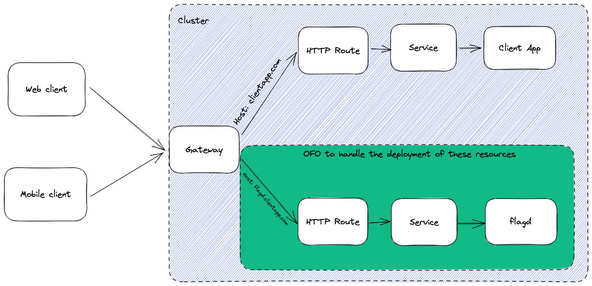

# Flagd client support driven by OpenFeature Operator

## State: WITHDRAWN

Client side applications (e.g. web/mobile) could benefit from access to feature flags. This OFEP outlines the feasibility and benefits of extending [OpenFeature Operator (OFO)](https://github.com/open-feature/open-feature-operator) to manage the deployment of flagd with access from external traffic (e.g. client side applications).

_Withdrawn for the following reasons:_
- _There's a huge variety of unknown deployment patterns by potential users. Catering to one likely means scope creep to support many in future. Perhaps this is the future path of OFO but an agreement has been reached that it is best to keep things simple and minimally scoped at this stage (until common deployment patterns are more established)._
- _OFO would require CRUD permissions for HTTPRoutes & Gateways, introducing security concerns._
- _Kubernetes Gateway API is still in beta._

_[OFEP for an alternative solution](./OFEP-ofo-flag-service.md)._

## Background

OFO already manages the deployment of flagd in server side contexts by injecting it as a sidecar container to an existing workload. This permits the workload to communicate with flagd due to the inherent nature of networking between containers within a pod. Conversely, the routing of client side applications to flagd is not trivial. OFO could bear this burden by configuring the cluster as necessary (see the proposal below) to facilitate the deployment of externally accessible (by client side applications) flagd.

## Assumptions
The (simplified) deployment pattern is as follows

- Deployment of a client side application exposed by a Service
- [Gateway](https://gateway-api.sigs.k8s.io/api-types/gateway/) exposing the app's Service via a [HTTPRoute](https://gateway-api.sigs.k8s.io/api-types/httproute/) and listener

The networking infrastructure for ingesting external traffic is already in place for the existing client side application.

## Proposal

Introduce a custom resource definition (CRD) with configuration permitting OFO to create a deployment of flagd and inject the necessary networking configuration to route incoming traffic from the existing Gateway to flagd (via a new HTTPRoute/GRPCRoute).
This results in flagd being externally accessible.

The following diagram depicts the architecture. Resources inside the green box are created via the proposed CRD.

Note: The example depicted by the diagram uses a subdomain to route the request to flagd but [path matching is also possible](https://gateway-api.sigs.k8s.io/api-types/httproute/#matches).

## Limitations
[Kubernetes Gateway API (KGA)](https://gateway-api.sigs.k8s.io/) is in beta (as are its implementors). This OFEP could be extended (or a new one created) to also support [Ingress](https://kubernetes.io/docs/concepts/services-networking/ingress/).
The [GRPCRoute](https://gateway-api.sigs.k8s.io/api-types/grpcroute/) is experimental.

## Proof of concept

A proof of concept has been created [here](https://github.com/open-feature/open-feature-operator/issues/371#issuecomment-1468511819) with an executable demonstration of the proposal.
