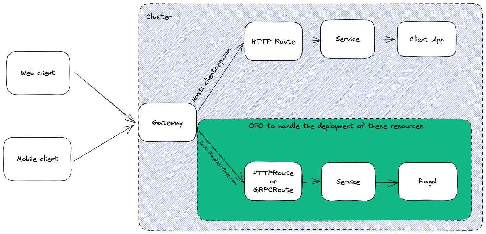

## flagd client support driven by OpenFeature Operator

## State: DRAFTING

Client side applications (e.g. web/mobile) could benefit from access to feature flags. This OFEP outlines the feasibility and benefits of extending [OpenFeature Operator (OFO)](https://github.com/open-feature/open-feature-operator) to manage the deployment of flagd with access from external traffic (e.g. client side applications).

## Background

OFO already manages the deployment of flagd in server side contexts, handling the networking necessary for server side applications to communicate with flagd. This greatly simplifies the steps necessary for administrators to introduce flagd into their cluster, reducing the barrier of entry. Obtaining these benefits for the deployment of externally accessible flagd is the critical motivator for extending OFO.

## Assumptions
The (simplified) deployment pattern is as follows

- Deployment of a client side application exposed by a Service
- [Gateway](https://gateway-api.sigs.k8s.io/api-types/gateway/) exposing the app's Service via a [HTTPRoute](https://gateway-api.sigs.k8s.io/api-types/httproute/) and listener

The networking infrastructure for ingesting external traffic is already in place for the existing client side application.

## Proposal

Introduce a custom resource definition (CRD) with configuration permitting OFO to create a deployment of flagd and inject the necessary networking configuration to route incoming traffic from the existing Gateway to flagd (via a new HTTPRoute).
This results in flagd being externally accessible.

The following diagram depicts the architecture. Resources inside the green box are created via the proposed CRD.

## Limitations
[Kubernetes Gateway API (KGA)](https://gateway-api.sigs.k8s.io/) is in beta (as are its implementors). This OFEP could be extended (or a new one created) to also support [Ingress](https://kubernetes.io/docs/concepts/services-networking/ingress/).

## Proof of concept

A proof of concept has been created [here](https://github.com/open-feature/open-feature-operator/issues/371#issuecomment-1468511819) with an executable demonstration of the proposal.
