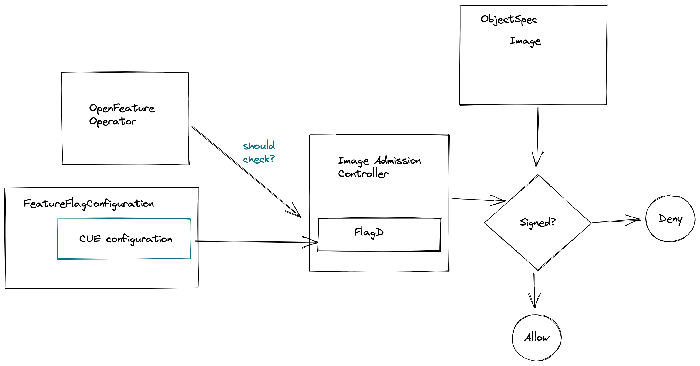

# Kubecon demo

## State: APPROVED

I believe we need to have some really good examples of feature-flagging on both the client/developer side and also used in infrastructure scenarios.

I propose that we combine several key technologies to build a very compelling demo.

Open feature operator + flagD
Sigstore/cosign
CUE
The following proposal is to build a demo image admission application that could potentially be spun out into a real project eventually. The tie into OpenFeature is that it would read its flag configuration to decide whether the image signing validator is turned on or off.

Comments welcome.

## Work involved

- Write a CUE based ievaluator
- Extend Openfeature operator to read CUE based configuration
- Write the demo image admission controller

## End-user takeaways

Featureflags can be used at the infrastructure level
OpenFeature operator and FlagD allow you to build against them with no real work required to integrate ( evaluator included ).